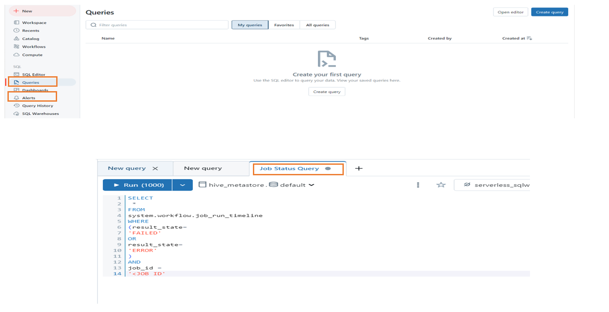
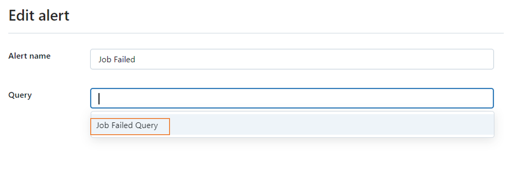
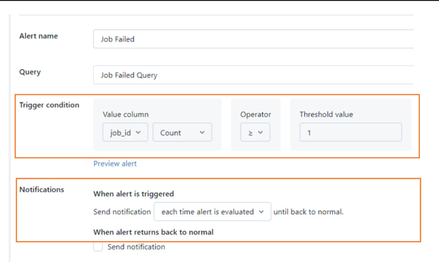
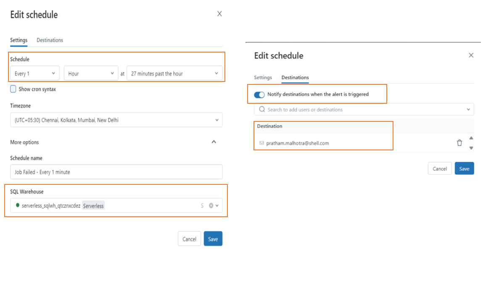
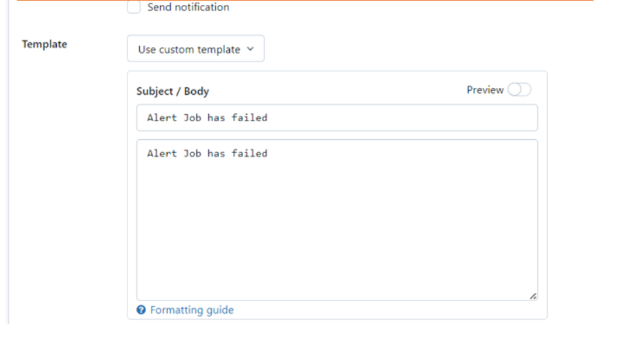
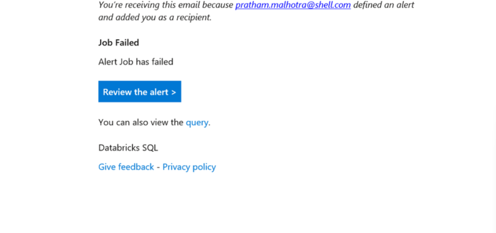

**Task:** monitor job status using system table

## Job Status Categories in System Table
To Monitor the fine grained status of the job we could make use of system tables specifically **“system.workflow.job_run_timeline”**. This table classifies the job run status in 7 categories, these are **TIMED_OUT,null, CANCELLED, FAILED,SUCCEEDED,SKIPPED,ERROR.**

To fetch job status to fileter out rows in which the Job has failed we can make use of an SQL query that uses the table mentioned above and filter its data based on Job ID and the run status, additionaly we can also specify the date and time based on the frequency on which the job runs.

## Databricks Alerts Overview:

To get notified in case of Job Failures we can make use of **Databricks Alerts**. Using them we can leverage a SQL query to run periodically to check for Job Failures. Databricks Alerts classify the evaluation of query based on the threshold condition we have set, into three categories that is **Unknown, OK, Triggered.** In this application based on the threshold condition we will be applying if the status of Alert is shown as **“Triggered”** it implies the threshold that we have configured to check for job failure data has exceeded, implying the job has failed. In case the status is **“Unknown” or “OK”** it implies the job has not failed.

## Steps to set up Databricks Alerts to get Notified for Job Failures

**Step 1 Customization of the SQL Query:** SELECT  \* FROM system.workflow.job_run_timeline WHERE (result_state='FAILED' OR result_state='ERROR') AND job_id = '&lt;place Job ID here&gt;'

**Step 2 Setting up of SQL Query in Data Bricks:** Under the SQL Sub Menu open the Queries Tab and click on create new Query. Followed by that paste the query mentioned in step 1 in the editor. Save the query onto your Workspace giving it a unique name.

**Step 3 Configure Databricks Alerts:**

**Step 3.1** Under the SQL Sub Menu open the Alerts Section. For reference check the highlighted portion of the above screenshot.

**Step 3.2** Select the Query we created in step 1 as results from it will be used to evaluate the status of the job run.

**Step 3.3** Set the trigger condition to evaluate the Job ID COUNT, Operator as >= and Threshold value to 1.

**Step 3.4** Configure to send Notification “each time alert is evaluated” this will ensure a notification will be triggered whenever the alert status is TRIGGERED regardless of its status at the previous evaluation. For Reference check out the highlighted portion of above screenshot.

**Step 3.5** Set the Schedule to evaluate the Query based on the frequency of job runs. Addition to that we can also configure the destination where we wish to receive the Email Alerts.

**Step 3.6** Configure the message template, this will be the Email that will be triggered in case of Job Failure.

**Output:**                                                                                                         
