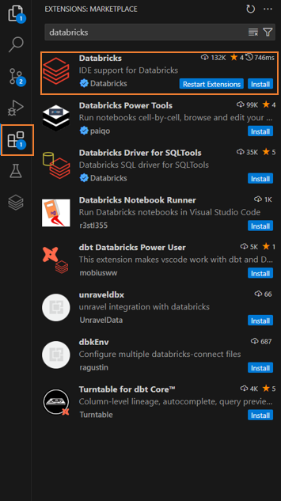
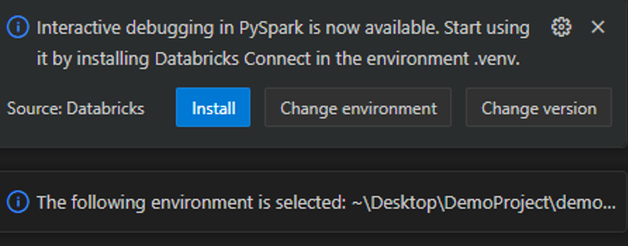
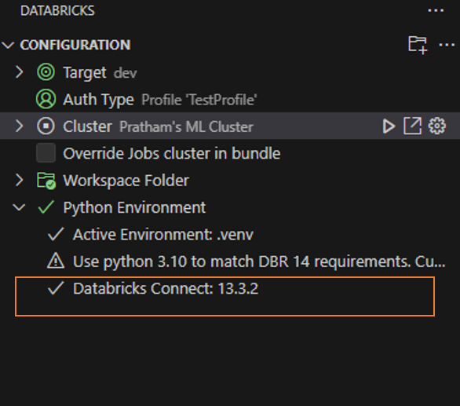

### Installation of Databricks Extension v2
Step 1 Head over to the Extension Section in VS Code.   
Step 2 In the search box type Databricks.  
Step 3 Click on the top-most result bearing the Databricks Logo. 
  
Step 4 Install the Databricks Extension on the VS code. 
  
Step 5 Post installation restart the application.  

### Configuration of Databricks Extension for VS code
Step 1 Select the Databricks Extension option coming on the left menu.    
Step 2 To run Python Notebooks or Files stored onto the local system you will get two options create a new Databricks Project or if a folder is already open an  additional option Migrate current Folder to a Databricks Project and additionaly if multiple Databricks project are open on the local system an additional option to open an Existing Databricks Project.    
Step 3 For the purpose of this tutorial we will be doing our setup by selecting the Create a new Databricks Project. Click on the create a new Databricks Project Button on the left hand menu.  
  
Step 4 Post clicking Create a new Databricks Project We are presented with an option to configure a Databricks Workspace. For this configuration head over to your Databricks Workspace URL in the search engine and copy the part until **Example: "https://adb-xyz.123.azuredatabricks.net/"**.  
  
Step 5 After entering the workspace URL in the dialog box we are presented with an option to select a method of authentication, If Azure CLI is installed on your system using az login we can authenticate to Databricks else for this iteration we are using **Oauth Authentication Mechanism**, thus click on Oauth option to automatically authenticate with the Databricks. 
  
Step 6 After successfully authenticating, provide the name to the project and a path where it will be stored on our local system.  
  
  
Step 7 After configuring the project on the right side of the console a command line based setup screen pops up where we are presented with options to configure the basics of our project such as language we will be using whether to include a default notebook, default DLT pipeline etc, based on your application select the options. For the purpose of this tutorial all options have been selected.  
  
Step 8 Post completing all these steps open the the project from the dialog box that pops on the top  

### Configuration of Cluster, Databricks Connect and Virtual Environment
## Attatching cluster to the Extension
Step 1 Now again open the Databricks Extension from the left sub menu. 
  
Step 2 Click on the option to select a cluster, now if you've got pre-configured clusters you can either select from those that appear in the list or you can create a new one, but in this case you're redirected to Databricks web page on your browser and steps to create a cluster are the same. For the purpose of this tutorial we are selecting a pre-configured cluster. Select a cluster that you are permitted to use from the drop-down menu that appears on the top. 
  
## Setting up Virtual Environment (Prerequisite to setup Databricks Connect)
Step 3 From the lower highlighted portion depicted in Step 1 click on **Activate virtual Environment with Python**
Step 4 To configure a new virtual environment, select **create a new environment** followed by **venv** from the drop down menu that appears from top.  
  
  
Step 5 Once the setup is completed a dialog box to install interactive debugging capabilities pops up. **Click on install button** 
  
Step 6 Verify post all the configuration the setup menu looks something like this, this configures the setup required for Databricks Conncect. For detailed documentation refer here: https://docs.databricks.com/en/dev-tools/databricks-connect/python/index.html, additionaly click on Databricks Connect and mention the latest time currently (15.4) 
  

### Running Sample Notebook 
Step 1 Now to run some sample code on Databricks, Head over to the explorer Menu where we have already opened our Project. Since during the initial configuration of setting up a new project we selected the option to create a sample notebook head over onto that notebook. (Refer to Step 7 Configuration of Databricks Extension for VS code under section) 
  
Step 2 Now if we run the notebook file using the **Play Button Associated with Databricks Logo** we get run the file as **Databricks Workflow**. The Workflow run will also be visible in our Workspace under workflow runs. 
  
  
**Note: To run the same notebbok using Databricks Connect use the play button that is left to the cell.  
Step 3 To run with Databricks connect we need to select the virtual environment. 
  
Step 4 A pop might pop up to install ipykernel package if it's not installed intall it. 
  
Step 5 Similary for a py extension file clicking on play with Databricks logo gives all the option to run file as workflow or databricks Connect in a drop down menu.  This example shows running the .py main file in our demo project using Databricks Connect. The highlighted portion below shows us the output we’ve got using databricks connect. 
  
